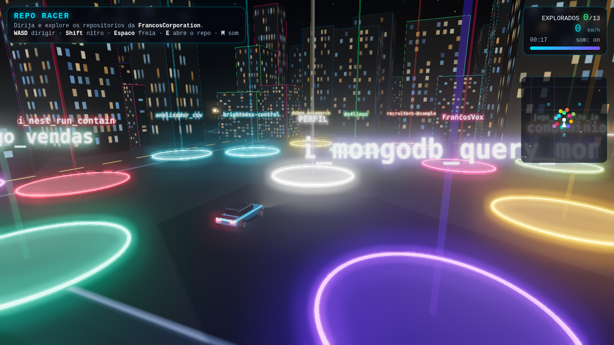

# Repo Racer

Jogo 3D no navegador em que você dirige por uma cidade neon e **explora os
repositórios** da FrancosCorporation: cada praça iluminada é um projeto — pare
em cima, veja a descrição e pressione **E** para abrir no GitHub.

[](https://francoscorporation.github.io/repo-racer/)




## Recursos

- **Cidade neon 3D** com prédios de janelas iluminadas, postes, estrelas,
  névoa e **bloom** (pós-processamento) com tone mapping cinematográfico
- **Garagem com 3 carros** — NEON (equilibrado), PHANTOM (veloz, traseira
  solta) e TANK (firme) — cada um com cor e dirigibilidade próprias
- **Nitro (Shift)** com barra de recarga, chamas no escapamento e FOV dinâmico
- **Trânsito com colisão**: carros circulam pelas avenidas e te atrapalham
- **Rampas com física de pulo**: decole, voe e aterrisse com fumaça
- **Som procedural** (WebAudio, sem arquivos): motor que responde à
  velocidade, cantada de pneu na derrapagem e mute com `M`
- **Marcas de derrapagem**, fumaça nos pneus e shake de câmera
- **Missão e cronômetro**: explore os 13 projetos, veja seu tempo e o recorde
  salvo no navegador
- **Minimapa** em tempo real com praças, rampas, trânsito e sua posição
- **HUD** com velocidade, nitro, progresso e painel do repositório
- **Controles de toque** para celular

## Como jogar

| Ação | Tecla |
|---|---|
| Acelerar | `W` / `↑` |
| Ré / frear | `S` / `↓` |
| Virar | `A` `D` / `←` `→` |
| Freio de mão | `Espaço` |
| Nitro | `Shift` |
| Abrir o repositório | `E` |
| Ligar/desligar som | `M` |

No celular aparecem botões na tela. O contador no topo mostra quantos
repositórios você já visitou — complete os 13 para fechar a missão.

## Jogar online

https://francoscorporation.github.io/repo-racer/

## Stack

- **Three.js** (r160, via CDN) — cena, luzes com sombras, reflexos (IBL),
  sprites, pós-processamento (bloom)
- **WebAudio** — som do motor e dos pneus gerado em tempo real
- **HTML/CSS/JS puro** — sem build, sem dependências instaladas
- **GitHub Pages** — hospedagem estática

## Rodar localmente

```bash
python3 -m http.server 8080
# abra http://localhost:8080
```

## Estrutura

```
index.html   # o jogo inteiro (cena, física arcade, áudio, HUD, controles)
preview.png  # screenshot usado no README
```

## Licença

MIT — veja [LICENSE](LICENSE).
