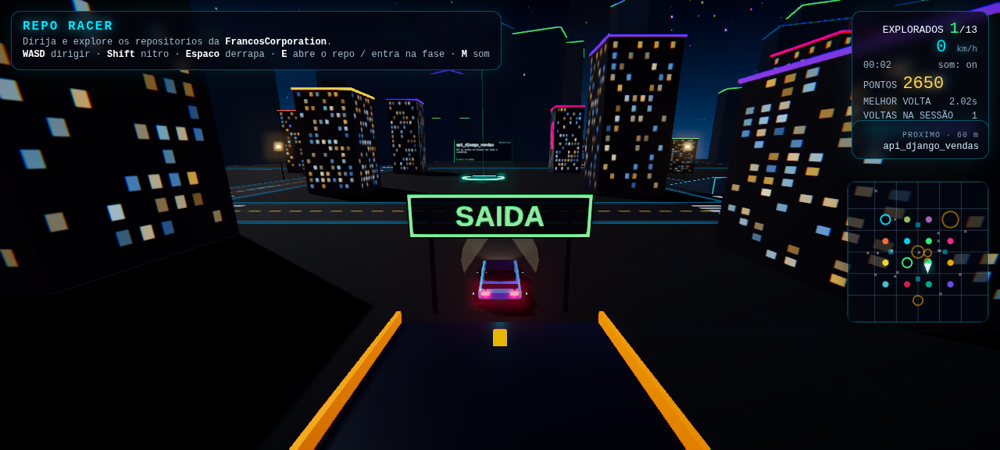

# Repo Racer

## 🚀 Rodar o jogo

Não existe etapa de build: o jogo inteiro é o `index.html` (Three.js vem por CDN).

### Sem Docker (mais simples)
```bash
git clone https://github.com/FrancosCorporation/repo-racer.git
cd repo-racer
python3 -m http.server 8080   # abra http://localhost:8080
```
Também funciona abrindo o arquivo direto: `open index.html`.

### Com Docker (opcional, só para servir o estático em nginx)
```bash
docker compose up --build     # abra http://localhost:8080
```
Sem compose, com a imagem oficial na mão:
```bash
docker run --rm -p 8080:80 -v "$PWD":/usr/share/nginx/html:ro nginx:alpine
```

> Docker aqui é **apenas um servidor web** para os arquivos estáticos
> (`Dockerfile` + `docker-compose.yml` + `docker/nginx.conf`) — não é build de
> aplicação, porque não há bundler, dependências npm nem transpilação.

Jogo 3D no navegador em que você dirige por uma cidade neon e **explora os
repositórios** da FrancosCorporation: cada praça iluminada é um projeto — pare
em cima, veja a descrição e pressione **E** para abrir no GitHub. Nos
**círculos de fase** espalhados pela cidade os mesmos botões aceitam desafios:
aquecimento, circuito de portais, zona de drift, caçada, o laço infinito e o chefão SEGV.

[](https://francoscorporation.github.io/repo-racer/)




## Recursos

- **Cidade neon 3D** com prédios de janelas iluminadas, postes, estrelas,
  névoa e **bloom** (pós-processamento) com tone mapping cinematográfico —
  agora com **faixas de pedestre nas 25 esquinas**, **calçadas** ladeando as
  10 avenidas e **antenas com luz vermelha piscando** nos topos (custo de
  render: 2 draw calls instanciados). O tubo do looping brilha, o entorno
  do laço ganhou muros, lixeiras e postes, e a HUD está mais polida (combo
  com "pop", minimap emoldurado)
- **Garagem com 3 carros** — NEON (equilibrado), PHANTOM (veloz, traseira
  solta) e TANK (firme) — cada um com cor e dirigibilidade próprias
- **Nitro (Shift)** com barra de recarga, chamas no escapamento e FOV dinâmico
- **Freio de mão (Espaço)** que derrapa de verdade: segure perto da curva para
  escorregar a traseira com fumaça e marcas de pneu
- **Drift boosting estilo kart**: derrapar carrega um turbo grátis — solte o
  freio de mão após ~0,9 s de cantada e ganhe **+22 de impulso** ("TURBO DE
  DRIFT!"); segure 1,8 s para o **SUPER TURBO** (+38). A carga some se você
  bater ou parar de derrapar sem completar
- **Pontuação de drift com combo até x8** — a cadeia de derrapagem acumula
  pontos ao vivo; bater no muro ou no trânsito perde a cadeia ("COMBO
  PERDIDO!") e o recorde de pontos fica salvo no navegador
- **Coletáveis de N2O** espalhados pelas avenidas: reenchem o nitro na hora e
  somam **+400** pontos (renascem em 40 s)
- **Bússola holográfica 3D** (estilo NFS Most Wanted): um holograma azul
  pequeno flutua alguns metros à frente do carro apontando o destino, com
  pulso e balanço suaves — o painel mostra nome e distância até a praça não
  visitada mais próxima
- **Chefão final: SEGV** — complete os 13 repos e libere o duelo no botão
  "ENFRENTAR O CHEFÃO": telegrafa, carga e janela de vulnerabilidade, 3
  corações contra 100 de vida em 90 s (atalho: `?boss=1`)
- **Derrapagem lateral de verdade** — física com trajetória atrasada: a traseira
  escapa para o lado com inércia e atrito (não só visual), o carro perde
  velocidade no deslize e o chefão SEGV também derrapa fechando curva
- **Fases em círculos**: seis arenas circulares com desafios próprios e
  desbloqueio por pontuação (veja [Fases](#fases))
- **Trânsito com colisão**: carros circulam pelas avenidas e te atrapalham —
  agora com rodas, cabine escura e faixa de vidro, e **sem escalar as rampas**
  (as faixas foram para fora do vão das rampas e o trânsito ignora o relevo).
  À noite os **faróis ficam acesos** e as **setas amarelas piscam**
- **Rampas com física de pulo**: decole, voe e aterrisse com fumaça (o salto
  só dispara no sentido de subida — o paredão segura o carro como um muro,
  inclusive de marcha à ré e **chegando pelo ar**; atacar pela lateral ou por
  trás **não atravessa** a rampa, o carro bate e para na face)
- **Looping estilo Hot Wheels** (perto da praça `36, 36`): pista de ENTRADA
  com guard-rails e **boost pads** que garantem os ~133 km/h exigidos pelo laço
  (o NEON chega sozinho em velocidade máxima; o TANK precisa dos pads ou do
  nitro — o boost deles vale por ~1,2 s, então não é engolido pelo teto de
  velocidade), tubo com casca sólida — quem vai devagar **quica na boca, com
  aviso de velocidade**, e o portal sul funciona como **semáforo** (verde =
  dá para completar, vermelho = falta) — e boca de SAÍDA ao norte que te
  devolve na rua já descendo a rampa, **sem salto**: o passeio começa e
  termina exatamente nas bocas do tubo. A entrada segue uma curva tangente ao
  tubo (sem salto) e a volta é regida por **energia real** (a gravidade segura
  na subida e empurra na descida). A **câmera acompanha a tangente** (roll +
  FOV do laço), o **fantasma translúcido** refaz sua melhor volta da sessão,
  e re-entrar em 45 s mantém o boost (**corrente de voltas**, até +1.200).
  Cada volta completa vale **+800** (+300 por volta na corrente) e o
  tempo é mostrado no toast e na linha **MELHOR VOLTA** da HUD. **8 orbes** ao
  longo do laço valem **+200 cada** e renascem em 40 s; o **melhor tempo de
  volta** fica salvo no navegador — bater o recorde dispara o toast
  "NOVO RECORDE DE VOLTA!". O cenário em volta ganhou vida: muros alinhados ao
  corredor, lixeiras, postes acesos e uma luz ciano que orbita a estrutura
- **Orla sólida**: os prédios do skyline no fim das avenidas agora têm colisão —
  não dá mais para entrar no meio deles
- **Som procedural** (WebAudio, sem arquivos): motor que responde à
  velocidade, cantada de pneu na derrapagem, chime ao visitar um repositório,
  blip de coleta e batida — mute com `M`
- **Marcas de derrapagem**, fumaça nos pneus e shake de câmera
- **Missão e cronômetro**: explore os 13 projetos, veja seu tempo, sua
  pontuação e o recorde salvo no navegador
- **Visual mais rico**: prédios com tons variados e **coroa neon no topo**,
  placas luminosas nas fachadas, **guias neon nas bordas das ruas**, pintura com
  verniz (clearcoat), rodas com aro de 5 raios e fita de neon nas saias do carro
- **Janelas que piscam devagar**: o brilho das janelas dos prédios respira em
  ritmos defasados por quarteirão (custo zero: só o `emissiveIntensity` de 8
  materiais compartilhados)
- **Poças refletivas** nas avenidas: manchas de asfalto molhado com metalness
  alto que espelham a cidade neon (120 no desktop, poucas no celular)
- **Dano cosmético**: bater amassa o **para-choque dianteiro** de verdade (ele
  encolhe e afunda a cada batida) e solta **faíscas** que quicam no chão; o
  carro sai da oficina renovado a cada nova corrida
- **Sombras de contato fake** sob os rivais e o chefão SEGV: manchas escuras
  ancoram os carros no chão — a do SEGV é quase do tamanho dele
- **Céu com estrelas e lua** (1300 estrelas, cúpula em gradiente roxo — custo
  zero por frame), névoa azulada e **reflexos de cidade neon** no metal/vidro do
  carro (ambiente PMREM procedural de skyline noturno)
- **Acabamento de pós-processamento**: bloom mais forte, **vinheta**,
  **aberração cromática** e leve saturação (sintetizados num único shader barato;
  no celular vira só vinheta)
- **Farol volumétrico** e **luz azul do nitro** no carro (desligados no
  LOW_END para economizar luzes)
- **Minimapa** em tempo real com praças, rampas, trânsito, fases (anel amarelo =
  bloqueada, verde = concluída) e rivais da caçada
- **HUD** com velocidade, nitro, pontos/combo, progresso e painel do repositório
- **Controles de toque** para celular (com botão DERRAPA) e **suporte a
  gamepad** (analógico + botões)
- **Qualidade adaptativa**: detecta mobile/GPU fraca e reduz sombras/pixel ratio (SMAA só no desktop)
- **Timestep fixo** de física (60 Hz) e limpeza de recursos ao sair

## Como jogar

| Ação | Tecla |
|---|---|
| Acelerar | `W` / `↑` |
| Ré / frear | `S` / `↓` |
| Virar | `A` `D` / `←` `→` |
| Freio de mão | `Espaço` |
| Nitro | `Shift` |
| Abrir o repositório / começar a fase | `E` |
| Ligar/desligar som | `M` |
| Gamepad | analógico + botões (A = acelerar, B = frear, R1 = nitro, LB = freio de mão) |

No celular aparecem botões na tela, incluindo **DERRAPA**. O contador no topo
mostra quantos repositórios você já visitou — complete os 13 para fechar a
missão. Derrapar, coletar N2O e visitar repositórios pontuam: façam o maior
recorde de pontos antes que o tempo acabe.

## Fases

Espalhados pela cidade existem **seis círculos de fase**. Chegue em cima de um
deles: o HUD mostra o desafio e você escolhe a **dificuldade** (FÁCIL/MÉDIO/DIFÍCIL,
botões no painel ou teclas **1/2/3**; **E** começa no médio). Cada fase tem
objetivo, cronômetro e recompensa próprios, e as seguintes **abrem conforme a
sua pontuação**.

| # | Fase | Tipo | Objetivo | Libera com |
|---|---|---|---|---|
| 1 | AQUECIMENTO | derrapagem | 600 pontos de drift em 60 s | sempre aberta |
| 2 | CIRCUITO NEON | portais | passar pelos 5 portais em ordem | 1.500 pts |
| 3 | ZONA DE DRIFT | pista que solta | 1.500 pontos dentro do círculo | 4.000 pts |
| 4 | CAÇADA | rivais | aguentar 50 s ou destruir os rivais | 8.000 pts |
| 5 | LAÇO INFINITO | looping | trazer as orbes do laço antes do tempo (x1/x2/x3) | 12.000 pts |
| 6 | SEGV // ARENA | chefão | derrotar SEGV no centro da cidade | 15.000 pts |

### Dificuldade

| Nível | Recompensa | O que muda |
|---|---|---|
| FÁCIL · x1 | recompensa base | +25% de tempo, metas 20% menores, 5 vidas na caçada, SEGV com 70 de vida e mais lento |
| MÉDIO · x2 | **recompensa x2** | o jogo como foi balanceado: 3 vidas, SEGV com 100 de vida |
| DIFÍCIL · x3 | **recompensa x3** | −20% de tempo, metas 25% maiores, **1 vida**, **5 rivais** mais rápidos (4 de vida cada), SEGV com **150 de vida** e mais rápido |

- A dificuldade escolhida fica salva (`francos-repo-racer-diff` no `localStorage`)
  e vale para a próxima fase também.
- **Fugir em linha reta não funciona mais**: rivais e o SEGV *antecipam* o ponto
  para onde você vai (interpolação da sua velocidade) e os rivais **flanqueiam**
  (cortam caminho por lados alternados) — escape derrapando e mudando de direção.
- O SEGV agora **desvia de prédios** (sonda 3 pontos à frente e escolhe o lado
  livre) — sem mais travar nos quarteirões; nas cargas ele ainda pode se acidentar,
  e isso continua tirando vida dele.

- O desbloqueio olha a **melhor pontuação** (a que fica salva no navegador), então
  a progressão continua entre partidas; as fases concluídas ficam em
  `francos-repo-racer-phases` (`localStorage`).
- Fases concluídas podem ser **repetidas** — a recompensa vale de novo (multiplicada
  pela dificuldade escolhida).
- Na **zona de drift** o chão solta de verdade (aderência reduzida) e o combo
  sobe sem precisar do freio de mão; fora do círculo não conta.
- Na **caçada**, bata nos rivais enquanto eles estão em *recuperação* para
destruí-los (+350 cada) — fora dessa janela você perde uma vida.
- Na **arena**, espere SEGV entrar em recuperação e arremesse o carro nele.
- Atalho para testar uma fase: `index.html?phase=p3` (ou `?phase=3`).

## O Chefão

A fase 6 é o duelo contra **SEGV**, a máquina caçadora — o mesmo combate que
abre no botão **ENFRENTAR O CHEFÃO** depois de explorar os 13 repositórios.
Atalho direto para o combate: `index.html?boss=1`.

- SEGV **persegue**, **telegrafa** (olho piscando + beep) e parte para a
  **carga** — mais rápida que o seu carro; desvie!
- Enquanto ele se **recupera** (2,2 s parado), arremesse o carro nele:
  **-20 de vida** (-30 com nitro)
- Isca a carga contra um **prédio**: ele leva **-15** e fica atordoado
- Encostar fora da janela de vulnerabilidade custa **1 coração**
- Ele tem **100 de vida**; você tem **3 corações** e **90 segundos** — use o
  nitro e os coletáveis de N2O a seu favor
- Vitória vale **+5.000 pontos**; a derrota tem **TENTAR DE NOVO** (reinicia
  só a luta, sem perder seu progresso)

## Jogar online

https://francoscorporation.github.io/repo-racer/

## Stack

- **Three.js** (r160, via CDN) — cena, luzes com sombras, reflexos (IBL),
  sprites, pós-processamento (bloom + vinheta/CA + **SMAA**)
- **WebAudio** — som do motor e dos pneus gerado em tempo real
- **HTML/CSS/JS puro** — sem build, sem dependências instaladas
- **Debugar fácil**: com `?debug=1` o console ganha `window.__rr` para dirigir a
  cena em testes (`setCar`, `selCar`, `setAir`, `step`, `carState`, `loopState`,
  `startPhase`, `phaseState`, `phaseStatus`, `enemies`, `startBoss`, `getBoss`,
  `damageBoss`, `hurtPlayer`, `bossEnd`, `resetScore`, `resetProgress`, `keys`,
  `traffic`, `buildings`, `sparksCount`, `bumperDent`, `puddles`, `windowGlow`,
  `bossBlob`, `blinkerMat`, `loopCoins`, `loopBoostPads`, `wayArrowMesh`,
  `pads`, `resetCrash`, `instancedCounts`, `antennaCount`)
- **GitHub Pages** — hospedagem estática

## Rodar localmente

```bash
python3 -m http.server 8080
# abra http://localhost:8080
```

## Estrutura

```
index.html            # o jogo inteiro (cena, física arcade, áudio, HUD, controles)
MELHORIAS-LOOPING.md  # verificação do looping: diagnóstico, correções, validação
preview.png           # screenshot usado no README
Dockerfile            # nginx:alpine servindo os estáticos (sem build de app)
docker-compose.yml    # atalho: docker compose up --build na porta 8080
docker/nginx.conf     # config do nginx do container
```

## Licença

MIT — veja [LICENSE](LICENSE).
